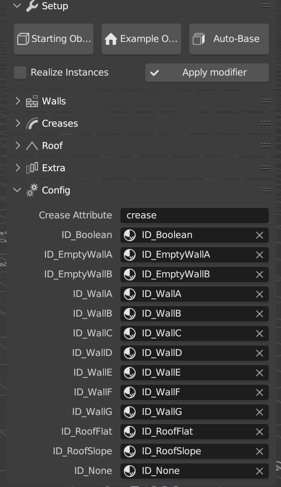

Config
-----------------
.. list-table::
   :header-rows: 0
   :widths: 22 120

   * - **Cleanup duplicated ID materials**
     - Can be used to remove the duplicated material, when you have .001 in the name of your materials.
   * - **Update modifier**
     - Used to udpate the Geometry node when new release are out, some setting may change and need to be changed.
   * - **Master seed**
     - Can change multiple seed creating the building to do a new version fast.
   * - **Attribut Top/Bottom/Corners**
     - Output those groups if you want to use them in your materials.

Normally you won't need to touch this menu. But it's useful to keep an eye on it if something doesn't work properly. 
The most comon problem is to have duplicated materials in the scene. With the tool looking for the wrong ones (ie: ID_Boolean.001)

Please make sure that the materials assigned to the building and the Boolean material on the parts are the same ones you can find in this menu.

