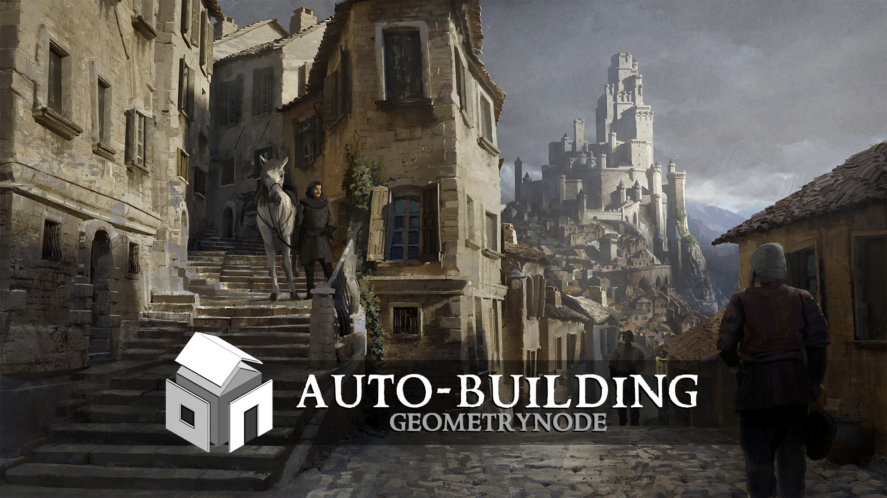

Welcome!
===================================

Welcome to the Auto-Building's documentation!

.. note::
   **This version of the addon is for Blender 4.5 or above, only!**

.. note::
   **The system is using geometry node to run, the Addon itself is not mandatory but provides a better interface as well as some useful actions.
**

Introduction
~~~~~~~~~~~~
------------------------

The idea is to start from a simple low-poly mesh and procedurally replace its faces with building elements, allowing you to create detailed structures.

Although the result can look complex, it remains easy to edit and iterate on, since everything is handled procedurally using Geometry Nodes.

You first need to build your building parts separately and organize them into dedicated collections (Windows, Doors, Balconies, etc.).

Then, you set up the system by assigning each collection to a specific category, either through the add-on menu or directly in the Geometry Nodes modifier.

Once this is done, assigning that the ID material correspinding to the category to any face of your base mesh will automatically spawn the objects from the corresponding collection at the center of that face.

A lot more things can be done and this documentation will explain all the settings. 
Feel free to open the Sample scene to see what's possible and how it works :D

.. toctree::
   :maxdepth: 2
   :hidden:
   :caption: 🚀 Start

   installation
   Setup
   Buildingparts

.. toctree::
   :maxdepth: 2
   :hidden:
   :caption: 🏠 Settings

   walls
   creases
   roofs
   extra
   config

.. toctree::
   :maxdepth: 2
   :hidden:
   :caption: ✨ Other

   autobase
   baking

.. toctree::
   :maxdepth: 2
   :hidden:
   :caption: ✉️ Contacts

   credit

